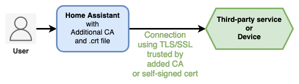
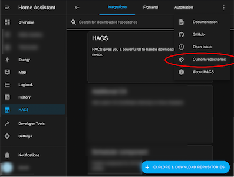
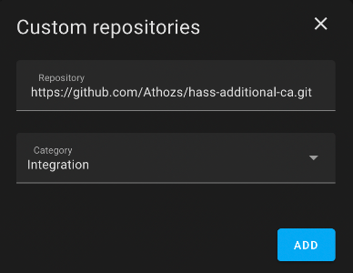

[](https://github.com/hacs/integration)
[](https://github.com/hacs/integration)
<!--
[](https://github.com/Athozs/hass-additional-ca/releases/latest/download/additional_ca.zip "Download")
-->

<p align="center">
  
</p>

# Additional CA for Home Assistant

_Additional CA_ integration for Home Assistant loads automatically private Certificate Authority or self-signed certificate into Home Assistant in order to access 3rd-party service with TLS/SSL, even after Home Assistant OS or Home Assistant with Docker is upgraded.


## 📘 What to understand meaning private Certificate Authority (CA) ?

* In case you manage your own CA, or you trust a CA, it gives you a kind of `ca.crt` file (or equivalent), that could be named shortly a personal / own / private / custom CA.

* In case you generate a self-signed TLS/SSL certificate, it gives you a `.crt` file (or equivalent), that could be an equivalent of a personal / own / private / custom trusted CA.

📒 This documentation uses 'private CA' or 'self-signed cert' alternatively for the same purpose.


## 📘 What are the use-cases with this integration ?

You want to import Certificate file into Home Assistant OS / Docker container trust store, in order to access 3rd-party service with TLS/SSL:

* Some of your installed integrations in Home Assistant need to access devices or third-party services with TLS/SSL (HTTPS, etc), and you got a ca.crt (or equivalent) from the service provider, you can load it with _Additional CA_ integration.
* You generated a self-signed TLS/SSL certificate for your own service (personal HTTPS Web server, SMTP, LDAP, etc) that you want to be trusted by Home Assistant, you can load it with _Additional CA_ integration.




## 📘 Quick Setup (TL;DR)

* [Install HACS](https://hacs.xyz/docs/setup/prerequisites)
* Install _Additional CA_ integration via HACS or manually without HACS, full docs here-under
* Copy private CA to config folder:

```shell
mkdir -p config/additional_ca
cp my_ca.crt config/additional_ca/
```

```yaml
# configuration.yaml
---
default_config:
additional_ca:
  my_private_ca: my_ca.crt
# ...
```

* Export environment variable if running Home Assistant with Docker (no need in case of Home Assistant OS):

```yaml
# compose.yml
version: '3'
services:
  homeassistant:
    # ...
    environment:
      - REQUESTS_CA_BUNDLE=/etc/ssl/certs/ca-certificates.crt
```

* Restart Home Assistant
* Done!


___

__Table of contents__

- [Additional CA for Home Assistant](#additional-ca-for-home-assistant)
  - [📘 What to understand meaning private Certificate Authority (CA) ?](#-what-to-understand-meaning-private-certificate-authority-ca-)
  - [📘 What are the use-cases with this integration ?](#-what-are-the-use-cases-with-this-integration-)
  - [📘 Quick Setup (TL;DR)](#-quick-setup-tldr)
  - [1. INSTALL WITH HACS](#1-install-with-hacs)
  - [2. INSTALL WITHOUT HACS](#2-install-without-hacs)
    - [2.1. Docker](#21-docker)
    - [2.2. HAOS - Home Assistant Operating System](#22-haos---home-assistant-operating-system)
    - [2.3. Core](#23-core)
  - [3. CONFIGURATION](#3-configuration)
  - [4. UPGRADE](#4-upgrade)
    - [4.1. Home Assistant](#41-home-assistant)
    - [4.2. Additional CA](#42-additional-ca)
  - [5. HOW DOES _Additional CA_ WORK UNDER THE HOOD ?](#5-how-does-additional-ca-work-under-the-hood-)
    - [5.1. Docker](#51-docker)
    - [5.2. HAOS - Home Assistant Operating System](#52-haos---home-assistant-operating-system)
  - [6. SET `REQUESTS_CA_BUNDLE` ENVIRONMENT VARIABLE](#6-set-requests_ca_bundle-environment-variable)
  - [7. HOW TO REMOVE A PRIVATE CA ?](#7-how-to-remove-a-private-ca-)
  - [8. UNINSTALL](#8-uninstall)
  - [9. TROUBLESHOOTING](#9-troubleshooting)
    - [9.1. General troubleshooting](#91-general-troubleshooting)
    - [9.2. Reset CA trust store of Home Assistant](#92-reset-ca-trust-store-of-home-assistant)
      - [9.2.1. Docker](#921-docker)
      - [9.2.2. HAOS - Home Assistant Operating System](#922-haos---home-assistant-operating-system)
    - [9.3. Tips](#93-tips)
  - [10. KNOWN ISSUES](#10-known-issues)


## 1. INSTALL WITH HACS

* [Install HACS](https://hacs.xyz/docs/setup/prerequisites) if not already done.
* Then, go to your Home Assistant,
    * -> HACS
    * -> Integrations
    * -> Click _Explore and Download Repositories_
    * -> Search for "Additional CA"
    * -> From the _Additional CA_ presentation page: click _Download_

<!--
If _Additional CA_ integration is not available from HACS interface, install _Additional CA_ by adding this Github repository to HACS custom repositories:

* [Install HACS](https://hacs.xyz/docs/setup/prerequisites) if not already done.
* Then, go to your Home Assistant,
    * -> HACS
    * -> Integrations
    * -> Click the Three-dots button in top-right corner
    * -> Custom repositories
    * -> Fill in
      - Repository: https://github.com/Athozs/hass-additional-ca.git
      - Category: Integration
    * -> Click Add

 
-->


## 2. INSTALL WITHOUT HACS

### 2.1. Docker

If you're running Home Assistant with Docker:

* Download and install using `git`:

```shell
# move to your Home Assistant directory containing the 'config' folder
cd /path/to/home-assistant
# git clone Addition CA integration
git clone https://github.com/Athozs/hass-additional-ca.git
# copy additional_ca integration to Home Assistant custom components
mkdir -p config/custom_components
cp -r hass-additional-ca/custom_components/additional_ca config/custom_components/
# Installation done, now see Configuration section (README.md)
```

* Download and install using `wget`:

```shell
# move to your Home Assistant directory containing the 'config' folder
cd /path/to/home-assistant
# download Addition CA integration archive
wget https://github.com/Athozs/hass-additional-ca/releases/latest/download/additional_ca.zip
# unzip archive
unzip additional_ca.zip
# copy additional_ca integration to Home Assistant custom components
mkdir -p config/custom_components
cp -r additional_ca config/custom_components/
# Installation done, now see Configuration section (README.md)
```

* Download and install manually

  - Click button to download ZIP of _Additional CA_ [](https://github.com/Athozs/hass-additional-ca/releases/latest/download/additional_ca.zip "Download")
  - Unzip archive
  - Move folder `additional_ca` into `config/custom_components/` directory
  - Installation done, now see Configuration section (README.md)


### 2.2. HAOS - Home Assistant Operating System

If you're running Home Assistant from HAOS:

* Go to the [Add-on store](https://my.home-assistant.io/redirect/supervisor_store/)
* Install one of the SSH add-ons (you need to enable advanced mode in your user profile to see them)
* Configure the SSH add-on you chose by following the documentation for it
* Start the SSH add-on
* Connect to the SSH add-on
* Download the latest release of _Additional CA_ from Github (.zip):

```shell
wget https://github.com/Athozs/hass-additional-ca/releases/latest/download/additional_ca.zip
```

* Unzip archive:

```shell
unzip additional_ca.zip
```

* Move or copy folder `additional_ca` into `config/custom_components/` directory:

```shell
mkdir -p config/custom_components
cp -r additional_ca config/custom_components/
```


### 2.3. Core

If you're running Home Assistant core (Python package) directly on host, you don't need _Additional CA_ integration. You should update your CAs from your host OS.


## 3. CONFIGURATION

For now, _Additional CA_ won't be visible in Home Assistant integrations dashboard, there is no UI component for _Additional CA_ integration. This may be possible in future release.

1. CA files must be in PEM format (often `.crt` or `.pem` extension). Check content with a text editor. Content example (following is a fake):

```text
-----BEGIN CERTIFICATE-----
ACeuur4QnujqmguSrHU3mhf+cJodzTQNqo4tde+PD1/eFdYAELu8xF+0At7xJiPY
i5RKwilyP56v+3iY2T9lw7S8TJ041VLhaIKp14MzSUzRyeoOAsJ7QADMClHKUDlH
UU2pNuo88Y6igovT3bsnwJNiEQNqymSSYhktw0taduoqjqXn06gsVioWTVDXysd5
qEx4t6sIgIcMm26YH1vJpCQEhKpc2y07gRkklBZRtMjThv4cXyyMX7uTcdT7AJBP
ueifCoV25JxXuo8d5139gwP1BAe7IBVPx2u7KN/UyOXdZmwMf/TmFGwDdCfsyHf/
ZsB2wLHozTYoAVmQ9FoU1JLgcVivqJ+vNlBhHXhlxMdN0j80R9Nz6EIglQjeK3O8
I/cFGm/B8+42hOlCId9ZdtndJcRJVji0wD0qwevCafA9jJlHv/jsE+I9Uz6cpCyh
sw+lrFdxUgqU58axqeK89FR+No4q0IIO+Ji1rJKr9nkSB0BqXozVnE1YB/KLvdIs
uYZJuqb2pKku+zzT6gUwHUTZvBiNOtXL4Nxwc/KT7WzOSd2wP10QI8DKg4vfiNDs
HWmB1c4Kji6gOgA5uSUzaGmq/v4VncK5Ur+n9LbfnfLc28J5ft/GotinMyDk3iar
F10YlqcOmeX1uFmKbdi/XorGlkCoMF3TDx8rmp9DBiB/
-----END CERTIFICATE-----
```

2. Create directory `config/additional_ca` and copy your private CAs into it:

```shell
mkdir -p config/additional_ca
cp my_ca.crt config/additional_ca/
```

Optionally, you could group CAs into folders.

Directories structure example:

```text
.
├── compose.yml
├── config/
│   ├── additional_ca/
│   │   ├── my_ca.crt
│   │   ├── selfcert.crt
│   │   └── my_folder/
│   │       └── selfcert_2.pem
│   │   └── some-super-ca/
|   |       ├── ca2.pem
│   │       └── ca3.crt
│   ├── blueprints/
│   │   └── ...
│   ├── configuration.yaml
│   ├── custom_components/
│   │   └── additional_ca/
│   │       ├── __init__.py
│   │       ├── const.py
│   │       └── manifest.json
│   ├── ...
...
```

3. Enable _Additional CA_ integration in `configuration.yaml` and set private CAs:

Model:

```yaml
# configuration.yaml
---
default_config:
additional_ca:
  <string>: <Certificate filename or Certificate relative path as string>
  <string>: <Certificate filename or Certificate relative path as string>
  # ...: ...
```

Example:

```yaml
# configuration.yaml
---
default_config:
additional_ca:
  my_awesome_ca: my_ca.crt                         # a cert file
  a_super_ca: some-super-ca/ca2.pem                # relative path + a cert file
  again_another_super_ca: some-super-ca/ca3.crt    # relative path + a cert file
  my_self_signed_cert: selfcert.crt                # a self-signed certificate
  self_signed_crt: my_folder/selfcert_2.pem        # relative path + a self-signed certificate
# ...
```

4. Optionally, if you're running Home Assistant with Docker, set environment variable `REQUESTS_CA_BUNDLE=/etc/ssl/certs/ca-certificates.crt`:

Example with Docker Compose:

```yaml
# compose.yml
version: '3'
services:
  homeassistant:
    container_name: homeassistant
    hostname: home-assistant
    image: homeassistant/home-assistant:2023.5.2
    volumes:
      - ./config:/config
    environment:
      - TZ=Europe/Paris
      - REQUESTS_CA_BUNDLE=/etc/ssl/certs/ca-certificates.crt
    restart: unless-stopped
    network_mode: host
```

5. Restart Home Assistant.

After upgrading Home Assistant to a new version, you need to reboot Home Assistant to load again your certificates.

6. Check the logs, look for pattern `additional_ca` in traces (there is not UI for _Additional CA_).


## 4. UPGRADE

### 4.1. Home Assistant

If you upgrade to a new version of Home Assistant, you need to reboot Home Assistant to load again your certificates with _Additional CA_.


### 4.2. Additional CA

If you upgrade to a new version of _Additional CA_, you need to reboot Home Assistant to load again your certificates.


## 5. HOW DOES _Additional CA_ WORK UNDER THE HOOD ?

### 5.1. Docker

If you're running Home Assistant with Docker:

When enabled, _Additional CA_ integration looks for private Certificates Authorities files (CAs) and self-signed certs in `config/additional_ca` directory.

_Additional CA_ loads private CAs and self-signed certs only at Home Assistant startup.

It copies private CAs and self-signed certs to `/usr/local/share/ca-certificates/` directory inside container and uses `update-ca-certificates` command line to update TLS/SSL trust store.


### 5.2. HAOS - Home Assistant Operating System

HAOS is actually a Linux OS running a `homeassistant` Docker container inside.

If you're running Home Assistant from HAOS or Supervised installation, _Additional CA_ integration works the same way as with Docker, but you can't export environment variable permanently in HAOS, so there is a workaround: _Additional CA_ integration will also add private CA in Certifi CA bundle `/usr/local/lib/python3.xx/site-packages/certifi/cacert.pem` inside `homeassistant` container if not yet present (thanks to @nabbi for the contribution).

Thus, for HAOS, your private CA or self-signed cert will appear in container CA trust store and in Certifi CA bundle (both inside `homeassistant` container).

After upgrading Home Assistant to a new version, you need to reboot Home Assistant to load again your certificates.


## 6. SET `REQUESTS_CA_BUNDLE` ENVIRONMENT VARIABLE

Home Assistant implements an SSL context based on the environment variable `REQUESTS_CA_BUNDLE`.

Only for Docker installation type and Core installation type, you may need to set environment variable `REQUESTS_CA_BUNDLE=/etc/ssl/certs/ca-certificates.crt`

This is optional, it depends on your installed integrations.

Anyway, setting environment variable `REQUESTS_CA_BUNDLE=/etc/ssl/certs/ca-certificates.crt` __should not__ break your Home Assistant server.

 > 📝 __Note__: At time of writing, I could not find on the internet a reliable way to set permanently an environment variable in Home Assistant OS. As a workaround, _Additional CA_ integration adds your private CA into Certifi CA bundle if not yet present.


## 7. HOW TO REMOVE A PRIVATE CA ?

Remove or comment CA entry under `additional_ca` domain key in `configuration.yaml`:

```yaml
# configuration.yaml
---
default_config:
additional_ca:
  # my_awesome_ca: my_ca.crt
# ...
```

Note: `additional_ca` domain key need to be enabled in `configuration.yaml` to remove CA files on next restart of Home Assistant.

Optionally remove your private CA file from `config/additional_ca/` directory.

Then, restart Home Assistant.


## 8. UNINSTALL

1. Delete _Additional CA_ from custom components:

Uninstall from HACS, go to your Home Assistant,
* -> HACS
* -> Integrations
* -> Additional CA
* -> From the three-dots menu: click _Remove_

Or uninstall manually:

```shell
rm -r config/custom_components/additional_ca
```

2. Remove `additional_ca` domain key from `configuration.yaml`:

```yaml
# configuration.yaml
---
default_config:
# additional_ca:
#   my_awesome_ca: my_ca.crt
# ...
```

3. Optionally remove additional_ca folder containing your private CA:

```shell
rm -r config/additional_ca
```

4. Restart Home Assistant.

If using Docker Compose, recreate container:

```shell
docker compose up -d --force-recreate
```


## 9. TROUBLESHOOTING

Some tips to clean your CA trust store inside Home Assistant in case of failure.


### 9.1. General troubleshooting

* Enable INFO logs level in Home Assistant (see Tips below)
* Check error logs in Home Assistant Settings > System > Logs


### 9.2. Reset CA trust store of Home Assistant

#### 9.2.1. Docker

To reset CA trust store, if running Home Assistant with Docker:

Either

- (Preferable) Stop and remove HA container, it will remove all changes made inside container, then start again Home Assistant with Docker.

Or

- Manually remove private CA files from `/usr/local/share/ca-certificates/` directory inside HA container.
- Then update manually CA trust store running command `update-ca-certificates` inside HA container.


#### 9.2.2. HAOS - Home Assistant Operating System

To reset CA trust store, if running Home Assistant from HAOS or Supervised installation type, you could reset Certifi CA bundle, two ways possible:

Either

- (Preferable) Stop and remove `homeassistant` Docker container inside HAOS and reboot HAOS. From Home Assistant SSH prompt, run:

```shell
docker stop homeassistant
docker rm homeassistant
reboot
```

Or

- Downloading original bundle from https://raw.githubusercontent.com/certifi/python-certifi/master/certifi/cacert.pem
- Replace it at Certifi bundle path (to get Certifi bundle path: from SSH prompt, run command line `docker exec -ti homeassistant python -m certifi`).


### 9.3. Tips

* To enable INFO logs level, add the following to your `configuration.yaml`:

```yaml
logger:
  default: info
```

* To check your certificate validity, if using x509 certs, run:

```shell
openssl x509 -in config/additional_ca/my_ca.crt -text -noout
```

* To test manually that _Additional CA_ is working, see [Manual test with HTTPS](CONTRIBUTING.md#manual-test-with-https) from [CONTRIBUTING.md](CONTRIBUTING.md) docs.

## 10. KNOWN ISSUES

n/a
